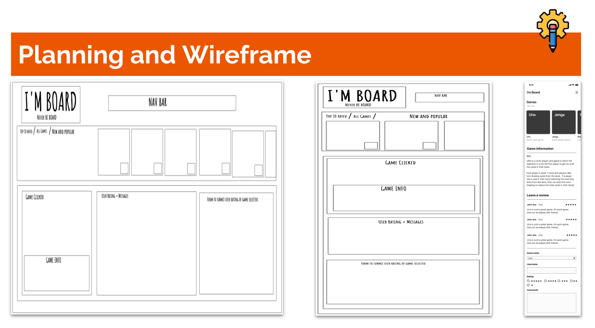

### Project name: Im Board

### Render links:

Front-end: https://team-project-1-xc83.onrender.com/
back-end: https://team-project-0ss1.onrender.com/

### Repo link:

https://github.com/TejiriAde/Team-Project

### Team members:

- Theo
- Jake
- Teriji
- Richard

We are team Tech Eggs

## Project description:

A website that allows users to find a peer reviewed board game.

## Problem domain:

“I’m bored and It’s hard to know what game to choose, I would like a website that helps me find a game that is peer reviewed.”

## User stories:

### As a user…

- As a user I want to be able to see a selection of games, click on it and see the information.

- As a user I want to be able to leave a review of the game.

- As a user I want this to be optimised for mobile.

- As a user I want to be able to see a carousel of games.

## Stretch goals

- As a user I want to be able to use arrow buttons to cycle through the game images

- As a user I want to be able to filter these games by highest/lowest rated.

- As a user I want there to be smooth transitions throughout the page.

- As a user I would like a menu to be optimised for mobile such as a hamburger menu.

## Wireframes

## Planning, collaboration and design Tools

- Project management: Trello
- Communication: Discord, Google Meet
- Presentation Slides: Google Slides
- Logo: Adobe Illustrator
- LF wireframes: OK! So...
- Moodboard and HF wireframes: Figma

## Packages

- Server: Express, Cors, dotenv, pg
- Client: Vite

## Lighthouse report:

## Reflections

### Please mention the requirements you met and which goals you achieved for this assignment.

- Design and Planning: Create wireframes and plan the layout and functionality of your web application.
- Front-End Development: Develop the user interface with HTML and CSS, focusing on a responsive and intuitive design.
- Interactivity: Implement dynamic content on the front end using vanilla JavaScript for DOM manipulation.
- Back-End Development: Build a server with Express that handles HTTP requests and communicates with a Postgres database.
- Database Integration: Design a database and use Postgres to store, update, and retrieve data efficiently using SQL queries.
- Collaboration: Work as a team to design and build a web application that showcases your skills in full-stack development, and collaborate on code using Git and GitHub.

### 🎯 Were there any requirements or goals that you were not quite able to achieve?

- Something we would like to look at in the future that feel off our original scope, is to create a relational database for updating the gallery items position based on reviews, this would allow them to be a dynamic top ten.

### 🎯 If so, could you please tell us what was it that you found difficult about these tasks?

- We don't yet have the knowlowdge to acheive it in the timeframe. We will be learning more about relational databases in the coming weeks.

### What went really well and what could have gone better?

- We loved working together as a team, our version control and collaboration went well.

### Describing errors or bugs you encountered while completing your assignment.

- We had a strange bug with Render not deploying, in the end it was a small syntax error which stopped the build of the website, we solved once we all had a chance to cast our eye over the render terminal log.

## References

- Images for board games: google images
- CSS reset: https://jgthms.com/minireset.css/
- Flexbox: https://www.youtube.com/watch?v=Ns12ALe8aqI
- Hamburger menu: https://medium.com/@mukundkumra.io/create-a-responsive-hamburger-menu-with-html-and-css-a-step-by-step-tutorial-c63e44fcee2e
- Icons: https://fontawesome.com/v4/get-started/
- Database Queries: https://www.w3schools.com/sql/sql_orderby.asp
